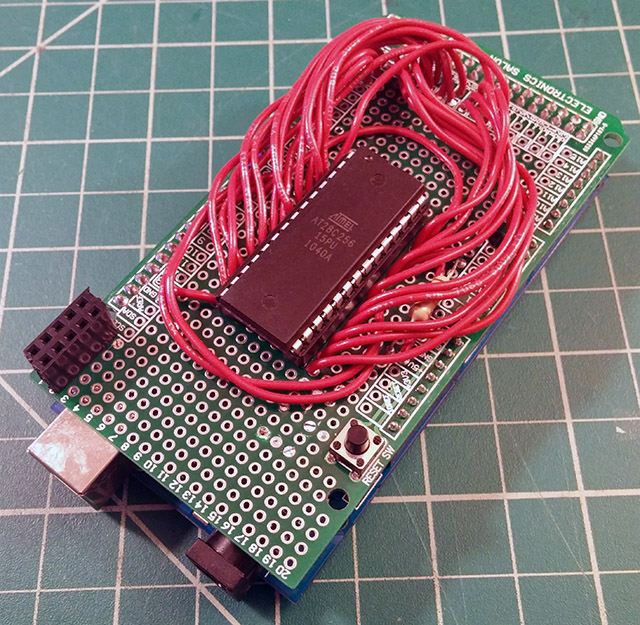

# AT28C EEPROM Programmer for Arduino Mega

This EEPROM programmer uses the Arduino Mega's large amount of Flash memory to store the hex array for programming. I didn't want to mess around with reading bytes from a file and passing through Serial. Just set HEX_FILE[] to the raw data and run the sketch.

The pinouts are all hardcoded for an Arduino Mega R3 specifically. There is definitely potential to adapt this for other boards, but you will be limited by the Flash memory of the AVR chip and the number of pins. Not much you can do about the Flash size, but adding some shift registers can take care of the lack of IO pins.

I've tested this with a AT28C64B, but it should work with any size chip with appropriate adjustments.

I made myself a shield to avoid breadboarding the massive amount of wires every time I needed this. Pro tip: Add a pullup resistor on the WE pin to avoid accidental writes when the board is booting.

