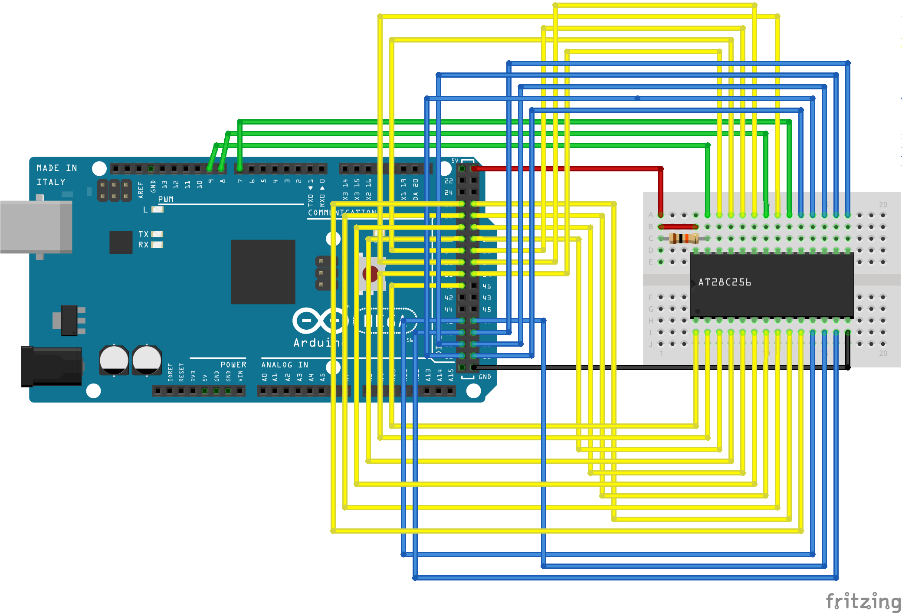

## Note: this project is archived and will not be maintained. Feel free to use it as a reference or create a fork.

# AT28C EEPROM Programmer for Arduino Mega

This is a simple way to program Atmel AT28C-style EEPROMs with an Arduino Mega.

There are two pieces: the Arduino firmware and the Python CLI.

## Setup

1) Wire up the Arduino as shown in the breadboard diagram below. Don't forget the 10kohm pullup resistor on the WE pin.
2) Flash the firmware to the Arduino.
3) Install pyserial: `pip install pyserial`
4) Run the Python CLI tool.

## Usage

Read the first 20 bytes of the EEPROM:
`python3 at28c_programmer.py -d /dev/ttyACM0 -r -l 20`

Flash a binary file to the EEPROM:
`python3 at28c_programmer.py -d /dev/ttyACM0 -w -f file.bin`

## Notes

1. I soldered this whole mess onto a PCB shield for the Arduino Mega with a ZIF socket to avoid having to wire this constantly.
2. This writes one byte at a time over the serial port. It is slow... If you have to flash huge binary files, you're probably better off with an off-the-shelf EEPROM programmer, but if you want to save $60, this will work for small files.
3. The `-w` write command also supports a limit `-l x` limit parameter. This will limit the writes to the first x bytes. Might be useful if your EEPROM binary file is padded with zeroes.

## Circuit

